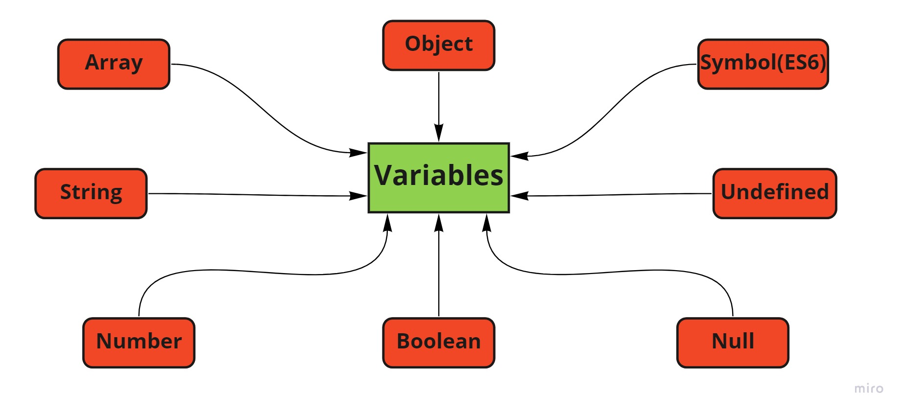

# JavaScript

# History of JavaScript .....
The Brendan Eich created JavaScript in 1995 Netscape Navigator web browser. JavaScript is scripting language . It is dynamic type variable we do not have to compile we directly run it. In Javascript  Everything is object.

# Control Structure .....

| Control Structure   |      Syntax     | 
|----------|-------------|
|if-else| if("condition"){ condition is true then it will excute}else{condition is flase then it will excute}|
|for loop|for(var=intialization,var=condition,var= ++,--)|
|Switch|switch(condition){case and break}|
|while loop|while(condition)  {code}|
|do-while loop|do{code} while(condition)|

# Arithmetic Operators .....
|operators   |      Syntax     | 
|----------|-------------|
|+|a+b|
|-|a-b|
|*|a * b|
|/|a / b|
|%|a %  b|
|==|a == b|
|===|a === b|
|!=|a != b|

# Logical && Operators .....

In logical and operator both condition will be get true then will get output.

* Condition && :-
  * true && false  ==>  false
  * false && false ==> false
  * false && true  ==>  false
  * true && true   ==>   true

 # Logical || Operators .....

  In logical or operator is any one condition is true then will get output.

  * Condition || :-
     * false || true ==> true
     * true  || true ==> true
     * true  || false ==> true
     * false || false ==> false

# Negation ! Operators.....
   In negation operator it will convert the value of truth value to false value and vice versa.
   * Condition ! :-
       * !0 = 1 {Convert false value to true}
       * !1 = 0 {Convert true value to false}

# Ternanry ? :  Operators
 * Condition :- 
     * a ? b : c
        * If a is true then b will be used.
    * a ? b : c
       * If a is false then c will be used.

# Javascript Data Types

 * Their is two data types in javascript
   
   <p align ="center"/>

* Primitive data types 
  ---
* number :-
```javascript 
   var a = 1;
   typeof a
   ---------
   output:- "number"
```
* string :-
```javascript 
   var a = "shashi";
   typeof a
   ---------
   output:- "string"
```
* boolean :-
```javascript 
   var a = "true";
   typeof a
   ---------
   output:- "boolean"
```
 * undefined :- (undefined can be value or type)
```javascript 
   var a = "undefined";
   typeof a
   ---------
   output:- "undefined"
```
*  Non-Primitive data types
   ---
*  Object :- 
```javascript 
   var a = {};  //declaration of object.
   typeof a
   ---------
   output:- "Object"
```
*  Array :- 
```javascript 
   var a = []; // declaration of array.
   typeof a
   ---------
   output:- "Array"
```
   

# Javascript Variables.....
 In Javascript, variables are nothing but a kind of container which holds  primitive data as well as non- primitive data .

 <p align ="center"/>

 * Difference Between Variable 
   ---
   
|var   | let | const |
|----------|-------------|-------------|
|  Can be redeclared   |  Cannot  be redeclared |  Cannot be redeclared |
| Can be re-initialized| Can be re-initialized|Cannot be re-initialized|
|It is function scope|It is lexical scope|It is lexical scope|
|Develop in ES5|Develop in ES6|Develop in ES6|
| hoisted| Doesn't get hoisted| Doesn't get hoisted|
|Syntax:- var a = value;|Syntax:- let b = value;|Syntax:- const c = value;|

# Functional Scope .....
  
* Local scope 
  ---
  * In local scope variables is define inside function this local scope will not access form outside function.

```javascript
   function shashilocal (){
       var a = 10; // local scope
       console.log(a);
   }
   shashilocal();

   ------ 
   output :- 10
```
* Global scope 
   ---
    * In global scope variable define outside the function can access any one.

 ```javascript
    var a = 10; // global scope
   function shashiglobal(){
       console.log(a);
   }
   shashiglobal();
   ------ 
   output :- 10
```
* Lexical scope
   ---
  * In lexical scope it will always start with {} and lexical scope is also called as block scope.
 ```javascript
   let a =5;
   if(a){ // lexical scope
       let a = 9;
       let b = 9;
       console.log (a+b);
   }
   ------ 
  output :- 18
```
# Closure .....
*  A closure is combination of function bundle together closure give us access to an outer function scope form an inner function.

 ```javascript
   function shashi(){
       var age = 23 ;
       function rai(){
           console.log(age) // closure use variable declared in the parent function.
       }
       rai();
   }
   shashi();
   ------ 
  output :- 23
```
# Copy By Value .....

* In copy by value C wants to copy A it will copy of memory value of A. In case after that A value is change then no change in C  because both memory location are different.

```javascript
   var a =10; 
   var b = a;
   console.log("value of a",a);
   console.log("value of b",b);
   ------ 
  output :- value of a 10 
            value  of b 10
```


<p align ="center"/>

# Copy By Reference .....

* In copy by reference variable A create object location and then point to other memory location where value store. In memory value their is Non-Primitive value then it will create a another memory location. Now B wants copy value of A by copy by reference now B creates a new object location and then point to same container . If we want to update in A container one value then it also change in B container because they pointed to the same container.

```javascript
   var shashi = {
         age = 23;
   }

   var rai = shashi;
   rai.age = 25;


   console.log("Age of shashi",shashi);
   console.log("Age of rai",rai);
   ------ 
  output :- Age of shashi 25 
            Age of rai 25 
```

<p align ="center"/>

# Javascript Functions .....

 * The function can be assign to a  variable .
 * Function can be redeclared .
 * Function is an object .
 * The function always referred has First - Class citizen .

* Function Syntax
  ---

 
 ```javascript

   function shashi(){ // function funtion name.

       console.log("Hello"); // value will print afetr calling function.
   }
   shashi(); // calling a function.
   
```
* Properties Of Function
  ---
  * Object 
  * Container 
  * Override
  * Local scope
  * Global scope
  * Hoisting

* Override
  ---
   * In override we have take two function and both functions name is same and with two different data. It will override the function one and print function two.


   ```javascript
   function rai(){
      console.log("print")
   }
   function rai(){
      console.log("hello") // override data of function 1.
   }
   rai();
   ------
   output :- hello
  ```
* Hoisting
  ---
  * The var variable is hoisted at the top when at a run time . It is hoisted to the near functional scope. function can be called before using declare.

 ```javascript
    function add(){
    console.log("addition",a+b);
}
var a = 10;
var b = 10;
add();

   -----
   output :- addition 20
```

* Function Declaration and Function Assignment
  ---

  *  Function Declaration
       * In function declaration we call function before declaration because it can be hoisted.

       ```javascript
         function fn_name(){ // function declaration.
            -- code --
         }
       ```

  *  Function Assignment 
       * In function assignment we does not call function before assignment  because it cannot  be hoisted.

        ```javascript
          var rai = function fn_name(){ // function assignment.
            -- code --
         }
       ```

* IIFE (Immediately Invoked Function Expression )
   ---

  * In IIFE do not assign any thing to function instead we wrap them into a block scope and then call function.

```javascript
   ( // IIFE
      function (){  // function unname
         console.log("init")
      }
   )(); // calling function
```

* Arrow Function
   ---
   * Arrow functions were introduced in ES6.Arrow function cannot get hoisted because function assign.

```javascript
  var missingskill = () => { // Arrow function declaration.
      console.log("Arrow");
   }
   missingskill();  // calling arrow function.
```

# JavaScript Constructor & Prototype ..... 

 * Prototype is basically kind of implementation of structure. 
 * Prototype like object every object is drive form prototype object.
 * And that prototype object is drive form it self. we cannot define end of object.

 * Array Object & String Prototype Method
   -------
   * Array Method

      <p align ="center"/>

      * push("") :- This method  is used to add data at the end of array.

      ```javascript
         name.push("hello"); // add array  at the end of array.
      ```

      * pop() :- This method  is used to remove data at the end of array.
      ```javascript
         name.pop(); // remove array at the end of array.
      ```

      * unshift("") :- This method  is used to add data at the starting of array.
      ```javascript
         name.unshift("hello"); // add array starting of array.
      ```

       * shift() :- This method  is used to remove data at the starting of array.
      ```javascript
         name.shift(); // remove array starting of array.
      ```
      * concat() :- The concat will add the old value with the new value and assign into new array.

      ```javascript
         var new_array = name1.concat(name2); // concat(name1+name2)
      ```

      * forEach() :- This abstract method is used achieve forloop without using for loop condition . In abstract method forloop is called as forEach.

      ```javascript
         name.forEach(); // Uses for loop
      ```
      * map() :- map is used to transforming the array.
      ```javascript
         name.map("function_name"); // Uses for loop
      ```
      * filter() :- filter is used to remove any type of data or array.
      ```javascript
        name.filter("function name");  // remove data or array.
      ```

      * indexOf() :- IndexOf method is used to find value of index and check item is present or not.If not present the indexOf value is always -1.
      ```javascript
         name.indexOf(); // find index value.
      ```
      * join() :- Join method is used to convert one data type to another data type.
      ```javascript
         name.join("delimiter"); // convert one datatype to other.
      ```
      * slice() :- Slice method is used to split array.
      ```javascript
         name.slice("start no of array/End no of array "); // split array.
      ```
      * isArray() :- It is use to check whether array or not.
      ```javascript
         Array.isArray("varname"); // check data is array or not.
      ```
   * Object Method 

   <p align ="center"/>

      * key() :- To find how many key present in the object constructor.
      ```javascript
         var varname = object.key(obj name); // find key.
      ```
      * freeze() :- Freeze method is used to freeze object after that their is no update will done.
      ```javascript
         Object.freeze(obj name); // obj freeze.
      ```
      * assign() :- Assign is used to copy value of one object to another object.
      ```javascript
         Object.assign(first obj,{second obj}) // copy value one obj to other.
      ```
      * tostring() :- tostring method is used to convert object into string.
      ```javascript
         Object.tostring(); // convert obj to str.
      ```
   * String Method

     <p align ="center"/>

      * toUppercase() :- toUppercase method is used to convert all string into uppercase.
      ```javascript
         text.toUppercase(); // convert str to uppercase.
      ```
      * toLowercase() :- toLowercase method is used to convert all string into lowercase.
      ```javascript
         text.toLowercase(); // convert str to lowercase.
      ```
      * split() :- split method is used to split all string into one one word
      ```javascript
         text.split(); // split into one word.
      ```
      * trim() :- This method is used to trim out data . it does not remove space between two text it only remove edges space.
      ```javascript
         text.trim(); // remove space.
      ```
      * replace() :- It will replace the old value to new value.
      ```javascript
         text.replace(); // replace value.
      ```

# Built In Function ES6 .....
  <p align ="center"/>

* SetTimeout() :- Settimeout is belong to the timer API.if we want some delay execution then this method is used.
```javascript
   SetTimeout(fun calling,time); // uses for delay execution.
```

* SetInterval() :- SetInterval is exactly  work has a SetTimeout but difference is continous running like timer loop.
```javascript
   SetInterval(fun calling,time); // uses for delay execution.
```

* parseInt() :- It convert any number into integer number it will strip the non-number value.
```javascript
   let  new = parseInt(varname); //convert no to integer no.
```